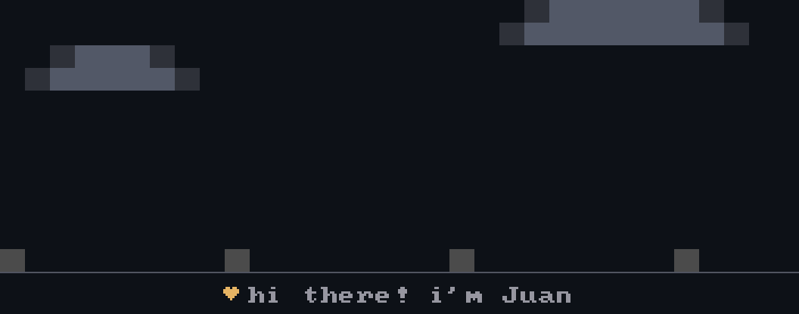

  

<h1 align="center">
    
</h1>

<h3 align="center">A passionate software developer from Indonesia</h3>
<h6 align="center">Hi, I’m Juann! As a freelancer with a deep passion for technology, I stay updated on the latest advancements. My expertise includes cybersecurity, networking, AI, cloud computing, and software development. I’m always exploring new tools and platforms to drive innovation.
You can find my resume <a href="https://drive.google.com/file/d/11UkFFOTGC9HduznafnOAfxfyG6_qwG0o/view?usp=sharing" target="_blank">Here</a>. update Nov 2, 2024</h6>
 
 

 

 
<h2 align="center">⚒️ Languages-Frameworks-Tools ⚒️</h2>
 

    
     

 

<h2 align="center"></h2>

 <em><b>I love connecting with different people</b> so if you want to say <b>hi, I'll be happy to meet you more!</b> :)</em>

<h2 align="center"></h2>

 

<h3 align="center">
    
</h3>

 

